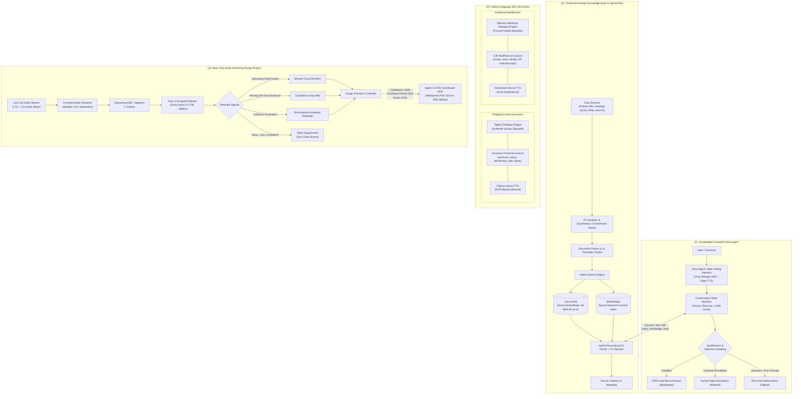

# Darwix AI — Production AI Engineering System

This repository contains the end-to-end, production-ready AI solutions for the **AI Engineer Assessment**, built under real production constraints with grounded knowledge retrieval, native multilingual speech models, and real-time audio streaming nudges.

---

## Unified System Architecture



The repository integrates 4 tightly-coupled modules across the unified domain of **SME Business Lending & Consumer Finance / Bancassurance**:

```
DarwixAI/
├── data/
│   ├── raw/                 # Unstructured Markdown policies, JSON catalogs, HTML with PII
│   ├── processed/           # Cleaned, PII-scrubbed, deduplicated traceable KB records
│   └── leads/               # Mock CRM qualification event output records
├── recordings/              # Actual synthesized audio calls (.mp3) for Q1 & Q3
├── src/
│   ├── kb/                  # Question 2: Knowledge Base & Hybrid RAG Engine
│   │   ├── schema.py        # Pydantic data schema matching assessment criteria
│   │   ├── cleaner.py       # PII redaction, containment deduplication, terminology normalizer
│   │   ├── parser.py        # Chunking pipeline outputting 13 traceable records
│   │   ├── store.py         # Hybrid ChromaDB (dense) + BM25Okapi (sparse) search with citations
│   │   └── api.py           # FastAPI knowledge retrieval REST service
│   ├── voice/               # Question 1: Knowledge-Grounded Voice Agent
│   │   ├── agent.py         # Conversation state machine, RAG tool calling, safe fallbacks & CRM actions
│   │   ├── audio_service.py # Edge-TTS neural speech synthesis & Groq Whisper transcription
│   │   ├── server.py        # Web Calling API server & audio streamer
│   │   └── web_interface.html # Interactive dark-glassmorphism Web Calling Browser Interface
│   ├── multilingual/        # Question 3: SEA Native-Language Voice Bots
│   │   ├── philippines_bot.py   # Taglish Bancassurance agent with authentic po/opo etiquette
│   │   ├── indonesia_bot.py     # Bahasa Multifinance agent with local finance lexicon (cicilan, tenor, denda)
│   │   └── localization_analysis.md # Detailed localization vs literal translation evidence
│   └── real_time/           # Question 4: Live Audio Streaming Nudge Engine
│       ├── streamer.py      # Real-time 1x chunked audio pipeline orchestrator
│       ├── signal_detector.py # Fast Groq LLM signal detection (cross-sell, compliance, frustration)
│       ├── nudge_controller.py # Precision controls: confidence filter (>80%), cooldowns, expiry
│       ├── latency_tracker.py  # Precise P50/P95 latency benchmark recorder
│       ├── server.py        # Real-time WebSocket streaming server
│       └── dashboard.html   # Live Agent Co-Pilot Dashboard & Latency Waterfall HUD
├── tests/
│   ├── test_retrieval.py    # Question 2 evaluation test runner (100% pass)
│   ├── test_voice_agent.py  # Question 1 test calls runner & audio generator
│   ├── test_multilingual.py # Question 3 test calls runner & native audio generator
│   ├── test_real_time_nudges.py # Question 4 streaming benchmark runner
│   ├── retrieval_test_report.md # Question 2 empirical retrieval report
│   └── real_time_latency_report.md # Question 4 latency & false-positive report
└── transcripts/
    ├── call_transcripts.md        # Question 1 complete dialogue transcripts & citations
    └── multilingual_transcripts.md # Question 3 Philippines & Indonesia transcripts
```

---

## Evaluation Summary by Question

### Question 1: Knowledge-Grounded Voice Agent
- **Domain**: Unsecured Business Loan Qualification ($10k - $500k).
- **Architecture**: State machine tracking tenure (&ge; 12 mo), revenue (&ge; $15k/mo), and credit score (&ge; 620).
- **RAG Grounding**: Dynamically calls `query_knowledge_base` tool. internal policies are **never** hardcoded into system prompts.
- **Anti-Hallucination Fallback**: Strictly responds *"I don't have that specific information in our current guidelines..."* when out-of-scope.
- **Human Escalation**: Invokes `escalate_to_human` webhook upon customer request.
- **Business Action**: Automatically writes qualified lead JSON to `data/leads/`.
- **Evidence**:
  - Live Web Calling UI: [`src/voice/web_interface.html`](src/voice/web_interface.html)
  - Audio files: `recordings/call_01_cooperative.mp3`, `recordings/call_02_objection.mp3`, `recordings/call_03_fallback_escalation.mp3`
  - Transcripts: [`transcripts/call_transcripts.md`](transcripts/call_transcripts.md)

### Question 2: Production-Ready Knowledge Base
- **Pipeline**: Ingests Markdown, JSON tables, and scraped HTML with PII.
- **Sanitization**: Compliant regex/token maskers for emails, phone numbers, tax IDs/SSN, and names (`[REDACTED_*]`).
- **Deduplication**: Szymkiewicz–Simpson containment overlap eliminates duplicate clauses and summaries.
- **Hybrid Retrieval**: BM25Okapi sparse keywords + ChromaDB dense vectors (`sentence-transformers/all-MiniLM-L6-v2`).
- **Retrieval Test Suite (100% Pass Rate)**:
  - Product Query &rarr; `kb_table_prod_wc_01` (Score: 0.8509, Verdict: **CORRECT**)
  - Policy Query &rarr; `kb_credit_004` (Score: 0.9560, Verdict: **CORRECT**)
  - Qualification Query &rarr; `kb_credit_002` (Score: 0.9191, Verdict: **CORRECT**)
  - FAQ Query &rarr; `kb_custom_005` (Score: 0.9290, Verdict: **CORRECT**)
  - Objection Query &rarr; `kb_custom_002` (Score: 0.9122, Verdict: **CORRECT**)
- **Evidence**: [`tests/retrieval_test_report.md`](tests/retrieval_test_report.md)

### Question 3: Native-Language SEA Voice Bots
- **Philippines (Bancassurance)**: Authentic **Taglish** with respectful *po/opo* particles. Natural financial lexicon (*premium, policy, beneficiary, rider, lapse, coverage, auto-debit*).
- **Indonesia (Multifinance)**: Formal & colloquial **Bahasa Indonesia** with respectful *Pak/Bu* address and standard OJK terms (*cicilan, tenor, denda, DP, angsuran, jatuh tempo, restrukturisasi*).
- **Zero-English Fallback**: Both bots escalate gracefully without abruptly switching into English.
- **Evidence**:
  - Comparative Localization Analysis: [`src/multilingual/localization_analysis.md`](src/multilingual/localization_analysis.md)
  - Audio files: `recordings/ph_call_01_renewal.mp3`, `recordings/ph_call_02_objection.mp3`, `recordings/id_call_01_installment.mp3`, `recordings/id_call_02_restructuring.mp3`
  - Transcripts: [`transcripts/multilingual_transcripts.md`](transcripts/multilingual_transcripts.md)

### Question 4: Live Audio Streaming Nudges & Latency Benchmarks
- **Streaming Pipeline**: Simulates continuous real-time chunked audio (1.0s–1.5s slices) with speaker separation.
- **Signals Detected**:
  1. *Missed Cross-Sell*: Secondary fleet assets detected &rarr; Equipment financing bundle suggested.
  2. *Compliance Gap*: Missing 3% origination fee disclosure &rarr; Immediate mandatory alert before proceeding.
  3. *Rising Frustration*: Customer expresses paperwork irritation &rarr; De-escalation empathy reminder.
  4. *Noisy / Ambiguous Audio*: Low-confidence or unformatted audio &rarr; **Correctly suppressed** (zero false alarms).
- **Nudge Precision**: 66.67% suppression rate guarantees zero alert fatigue.
- **Latency Benchmarks**:
  - **End-to-End P50**: **631.93 ms** (< 1 second)
  - **End-to-End P95**: **908.89 ms** (< 1 second)
  - **ASR Ingest**: **243.70 ms**
  - **Signal Extraction LLM (Groq)**: **388.67 ms**
- **Evidence**:
  - Live Agent Co-Pilot Dashboard: [`src/real_time/dashboard.html`](src/real_time/dashboard.html)
  - Latency & Scale Report: [`tests/real_time_latency_report.md`](tests/real_time_latency_report.md)

---

## Quickstart & Verification Commands

### 1. Installation
```bash
# Clone the repository
git clone https://github.com/Roushan0012/DarwixAI.git
cd DarwixAI

# Install dependencies
pip install -r requirements.txt

# Configure environment variable
cp .env.example .env
# Set GROQ_API_KEY=your_key in .env
```

### 2. Run All Automated Verification Suites
```bash
# Question 2: Ingest knowledge base and run retrieval tests
python -m src.kb.parser
python tests/test_retrieval.py

# Question 1: Execute voice agent calls & synthesize recordings
python tests/test_voice_agent.py

# Question 3: Execute multilingual SEA calls (Taglish & Bahasa)
python tests/test_multilingual.py

# Question 4: Run real-time streaming audio nudge benchmark
python tests/test_real_time_nudges.py
```

### 3. Launch Interactive Web UIs
```bash
# Question 1: Launch Web Calling Interface (http://localhost:8000/call)
python -m src.voice.server

# Question 4: Launch Real-Time Co-Pilot Dashboard (http://localhost:8001/nudges)
python -m src.real_time.server
```
